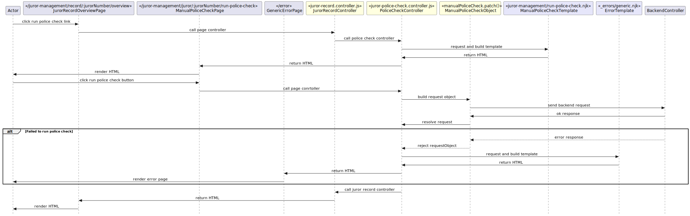

# 3.0 Manual Police Check
## 3.0.1 Description
From a juror's record, a jury officer has the ability to manually run a police check if one has yet to be run or there has been an error during a previous check. This flow includes one additional page.

## 3.0.2 Preconditions
This flow starts on the [Juror Record Overview page](./juror-record-overview.md). A jury officer clicks the 'Run a police check' link.

## 3.0.3 Controllers
`bureau/server/routes/juror-management/police-check/juror-police-check.controller.js`

| Method name | Purpose |
|-|-|
| getRunPoliceCheck() | This controller renders the interstitial page for to confirm the jury officer wants to run a police check for the selected juror. |
| postRunPoliceCheck() | The controller invoked by the POST request from the confirm police check screen, sending a patch request to the API to begin running a police check. |

## 3.0.4 Filters
N/A

## 3.0.5 Validators
N/A

## 3.0.6 Request objects
`bureau/server/objects/police-check.js`

| Request object | Call signature | Purpose | Response object |
|-|-|-|-|
| manualPoliceCheck | `PATCH moj/pnc/manual` | Manually runs a police check for a given juror number. | N/A |

## 3.0.7 Utilities
N/A

## 3.0.8 Validations
// TODO covered in 3.0.5, drop this section?

## 3.0.9 Exceptions
* Failed to run police check

## 3.0.10 Templates

`bureau/client/templates/juror-management/run-police-check.njk` 

This template renders an interstitial page that displays a button to allow the user to 'run police check' or cancel and go back to the juror record.

`bureau/client/templates/_errors/generic.njk` 

A generic error page used in case of an unknown exception from the API.

## 3.0.11 Sequence diagram
