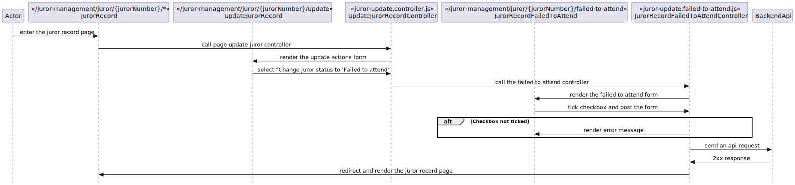

# X.0 LLD name
## X.0.1 Description
This document describes the journey that a user takes to mark a juror as 'Failed to attend'. This describes both marking and unmarking.

## X.0.2 Preconditions
The juror has responded and the option "Change juror statis to 'Failed to attend'" is selected in the update juror record actions form.

## X.0.3 Controllers
`bureau/server/routes/juror-management/update/juror-update.failed-to-attend.controller.js`

| Method name | Purpose |
|-|-|
| getFailedToAttend() | This function is responsible for rendering the form to mark a juror as "Failed to Attend". |
| postFailedToAttend() | This function is responsible for posting the selection, validating, and sending an api request to update the juror status. This will also be responsible for redirecting the juror back to `/juror-record/attendance` if the api responds with `2xx`. |

## X.0.4 Filters
N/A

## X.0.5 Validators
N/A

## X.0.6 Request objects
// TODO not yet implemented

## X.0.7 Utilities
N/A

## X.0.8 Validations
The post controller will validate if the checkbox to confirm as "Failed to attend" is ticked.

## X.0.9 Exceptions
N/A

## X.0.10 Templates
`bureau/client/templates/juror-management/attendance/failed-to-attend.njk`

This template displays a message to the user containing the juror's name, and why it should be marked as "Failed to attend". This also renders a single checkbox form that needs to be ticked in order to confirm the action.

## X.0.11 Sequence diagram
