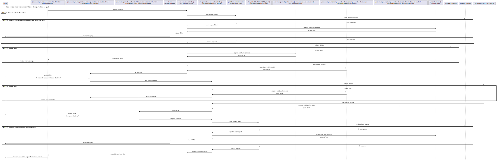

# 3.0 Bulk Change Next Due At Court
## 3.0.1 Description
From the Pool Overview, court users can change the next due at court date of multiple pool members at once. This flow includes two additional pages. 

## 3.0.2 Preconditions
This flow starts on the [Pool Overview page](./pool-overview.md). The user selects some number of jurors using the checkboxes, and then clicks the 'Chnage next due at court' button.

## 3.0.3 Controllers
`bureau/server/routes/pool-management/pool-overview/change-next-due-at-court/change-next-due-at-court.controller.js`

| Method name | Purpose |
|-|-|
| postChangeNextDueAtCourt() | The controller invoked by the POST request from the front end form. This controller validates the jurors that have been selected, and reroutes the request to the change next due at court page. |
| getChangeNextDueAtCourtContinue() | This controller renders the interstitial page for selecting the date to change jurors next due at court date to. |
| postChangeNextDueAtCourtContinue() | This controller is invoked by the POST request from the select next due at court date page. It validates the selected date to change the next court date to, if there is a validation error then the page is refreshed with error message displaying, if the date is valid the user is rerouted to the confirm date page. |
| getChangeNextDueAtCourtConfirm() | This controller renders the page for confirming the date to change jurors next due at court date to and how many jurors have been selected. |
| postChangeNextDueAtCourtContinue() | This controller is invoked by the POST request from the confirm next due at court date page. The change next at court date API is called for the list of jurors which user is redirected back to the pool overview screen with the newly updated attendance dates. |

## 3.0.4 Filters
`burau/server/components/filters`

* `dateFilter` is used to format dates used in the flow.

## 3.0.5 Validators
`bureau/server/config/validation/change-attendance-date.js`

* `jurorSelect()` - This validator checks that the user has selected a non-zero number of pool members on the Pool Overview page
* `bulkAttendanceDate()` - This validator ensures that the date selected is valid, in the correct format, and in the future.

## 3.0.6 Request objects
`bureau/server/objects/juror-attendance.js`

| Request object | Call signature | Purpose | Response object |
|-|-|-|-|
| changeNextDueAtCourtDTO | `PATCH moj/juror-management/attendance/attendance-date` | Changes the next due at court date for the provided list of jurors at specified pool. | `UpdateAttendanceDateDTO` |

## 3.0.7 Utilities
N/A

## 3.0.8 Validations
// TODO covered in 3.0.5, drop this section?

## 3.0.9 Exceptions
* Failed to change attendance dates for juror(s)

## 3.0.10 Templates

`bureau/client/templates/pool-management/change-next-due-at-court/change-next-due-at-court` 

This template renders an interstitial page that displays a date pickerfor the user ot sleect next due at court date, which can be confirmed using the form buttons at the bottom.

`bureau/client/templates/pool-management/change-next-due-at-court/change-next-due-at-court` 

This template renders a page confirming the dettails selected by the user, which can be confirmed using the form buttons at the bottom. 

`bureau/client/templates/_errors/generic.njk` 

A generic error page used in case of an unknown exception from the API.

## 3.0.11 Sequence diagram
