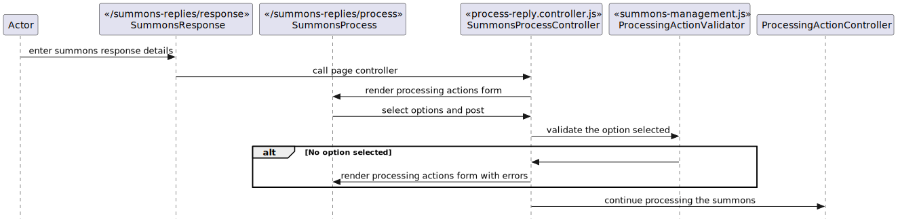

# 2.X Processing a Summons Reply
## 2.X.1 Description
This is the journey followed to process a summons submitted by a juror.

## 2.X.2 Preconditions
This journey can be accessed by both Jury and Bureau Officers and needs to be followed from a summons reply. If any user tries to visit this without coming from a summons reply page they should be redirected back and displayed an error.

## 2.X.3 Controllers
`bureau/server/routes/summons-management/process-reply/process-reply.controller.js`

| Method name | Purpose |
|-|-|
| getProcessReply() | This function renders the initial processing actions form from where the user will select how to process the summons. |
| postProcessReply() | This function gets invoked from a POST request that comes from the processing actions form. It then identifies which action was selected by the user, validating and then redirecting to the correct next step. |

## 2.X.4 Filters
N/A

## 2.X.5 Validators
`bureau/server/config/validation/summons-management.js`
`processAction();`

This validator will validate the form submitted and check if a valid process action was selected.

## 2.X.6 Request objects
N/A

## 2.X.7 Utilities
`isLateSummons()`

## 2.X.8 Validations
N/A

## 2.X.9 Exceptions
N/A

## 2.X.10 Templates
`bureau/client/templates/summons-management/process-reply.njk`

This template renders the processing actions form. This form can also be rendered in two ways, the normal version where the user gets prompted with 4 options, mark responded, defer, excuse or disqualify, and then there is the second version which is shown when a response is past its date, the user gets shown the options defer, excusal, diqualify, postpone or re-assign to an active pool.

## 2.X.11 Sequence diagram
