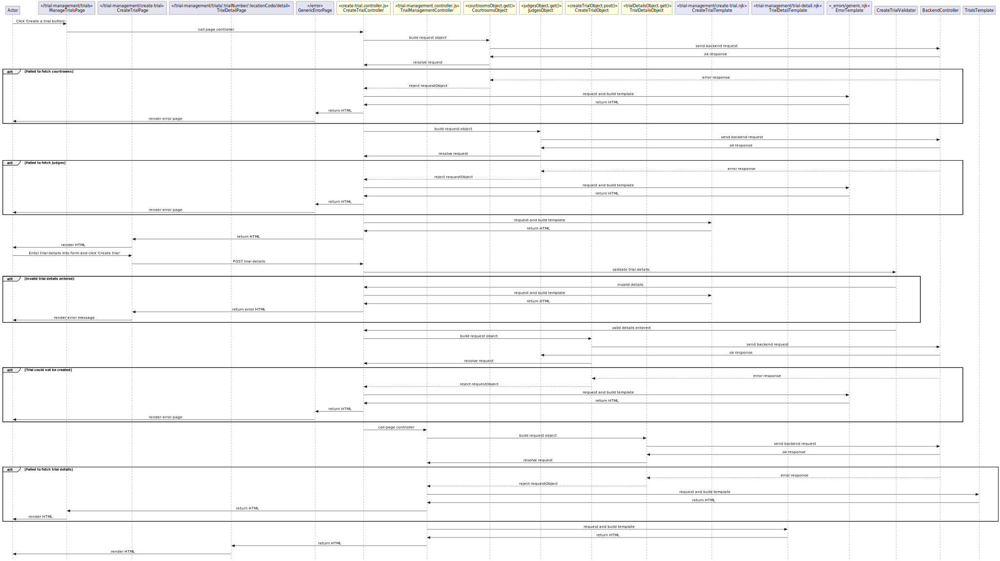

# 3.0 Create a trial
## 3.0.1 Description
From the manage trials view, jury officers can create a new trial. This flow includes between two additional pages.

## 3.0.2 Preconditions
This flow starts on the [Manage Trials page](../manage-trials.md). The user clicks the 'Create a trial' button.

## 3.0.3 Controllers
`bureau/server/routes/trial-management/create-trial.controller.js`

| Method name | Purpose |
|-|-|
| getCreateTrial() | This controller renders the initial page where the jury officer will enter the details for the new trial to be created. |
| postCreateTrial() | This controller is invoked by the POST request from the create trial page. It validates the user’s input for each field, if any field is invalid the user is redirected to the form showing any errors. If all of the inputs are valid then the create trial request object is called and the details are sent to the API endpoint where the trial is then created. The user is then redirected to the newly created [trial’s detail page](../manage-trials.md) on success. |

## 3.0.4 Filters
`burau/server/components/filters`

* `dateFilter` is used to format dates used in the flow.

## 3.0.5 Validators
`bureau/server/config/validation/create-trial.js`

This validator checks that the user has enter a valid input into each of the specific input fields
* A valid case number has been entered.
    * The trial number only contains numbers and uppercase letters.
    *	The trial number is less than 16 characters.
*	A trial type has been selected.
*	Either defendants or respondents have been entered dependant on whether a civil or criminal trial is being created.
*	A valid start date has been entered.
    *	The start date does not include any letters or special characters.
    *	The start date is in the correct format, for example 31/03/2023.
    *	The start date is a real date.
*	A judge has been selected from the auto-complete field.
*	If the jury officer has multi-court access, then a court has been selected.
*	A courtroom has been selected from the auto-complete field.

## 3.0.6 Request objects
`bureau/server/objects/create-trial.js`

| Request object | Call signature | Purpose | Response object |
|-|-|-|-|
| courtroomsObject | `GET moj/trial/courtrooms/list` | Fetches a list of courtrooms available to for the user to create a trial using. | `CourtroomsListDTO` |
| judgesObject | `GET moj/trial/judge/list` | Fetches a list of judges available to for the user to create a trial using. | `JudgeListDTO` |
| createTrialObject | `POST moj/trial/create` | Creates a trial, returning the summary of created trials details | `TrialSummaryDTO` |

## 3.0.7 Utilities
* `trialPayloadBuilder()` - This helper function takes in the body of the create a trial form along with the judges and courtrooms lists, creating and returing a payload in the correct format to be sent to the backend to create a trial using the `createTrialObject` request object.

## 3.0.8 Validations
// TODO covered in 3.0.5, drop this section?

## 3.0.9 Exceptions
* Failed to fetch judges or courtrooms list
* Failed to create a new trial

## 3.0.10 Templates
`bureau/client/templates/trial-management/create-trial.njk`

This templates renders a variety of inputs for the user to enter the trial to be created's details.
* Free text input for case number.
* Radio buttons for trial type with corresponding conditonal free text inputs for dependants/respondents.
* Date picker input for trial start date.
* Auto-complete for the judge entry.
* Radio buttons for court with corresponding conditonal auto-complete inputs for designated courtroom.
* Checkbox to mark whether trial is protected or not.

## 3.0.11 Sequence diagram
