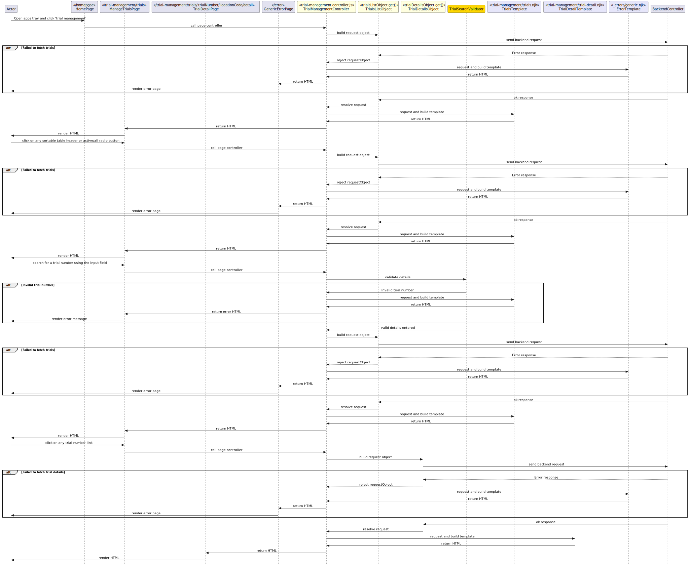

# 3.0 Manage trials
## 3.0.1 Description
From the manage trials view, jury officers can manage all/active trials. This flow includes two additional pages.

## 3.0.2 Preconditions
This flow starts once the user has logged in. The user opens the apps tray and clicks the 'Trial Management' link.

## 3.0.3 Controllers
`bureau/server/routes/trial-management/trial-management.controller.js`

| Method name | Purpose |
|-|-|
| getTrials() | This controller renders the initial trial management page where the jury officer can select whether to see a list of active or all trials, each making a call to the API endpoint to fetch those details. |
| getTrialDetail() |  This controller fetches all detail of a specific trial then renders trial-detail template to the user. |

## 3.0.4 Filters
`burau/server/components/filters`

* `dateFilter` is used to format dates used in the flow.
* `capitalizeFully` is used to format court location names to Title Case.

## 3.0.5 Validators
N/A

## 3.0.6 Request objects
`bureau/server/objects/create-trial.js`

| Request object | Call signature | Purpose | Response object |
|-|-|-|-|
| trialsListObject | `GET moj/trial/list?is_active&page_number&sort_by&sort_order` | Fetches a paginated and sortable list of all or active trials which available to the current user dependant on the query parameter. | `CourtroomsListDTO` |
| trialDetailsObject | `GET moj/trial/summary?trial_number&location_code` | Fetches the summary details for a specific trial using provided query parameters. | `PageTrialListDTO` |

## 3.0.7 Utilities
* `paginationBuilder`

## 3.0.8 Validations
// TODO covered in 3.0.5, drop this section?

## 3.0.9 Exceptions
* Failed to fetch trials
* Failed to fetch trial details

## 3.0.10 Templates
`bureau/client/templates/trial-management/trials.njk`

This templates renders two radio buttons to select all or active trials along with the corresponding sortable list of trials and detials.

`bureau/client/templates/trial-management/trial-detail.njk`

This template renders a summary table of the created trials details, along with buttons to 'Generate panel', 'Edit trial', and 'End trial'

## 3.0.11 Sequence diagram
